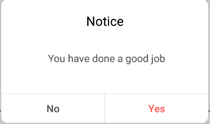

## WeDialog

### A simple, support customView dialog library based on DialogFragment. We can use it to show dialog more simply.

[中文版说明](readme_cn.md)


### Feature

- **Easier to use**

- **Show dialog on a anchor view**

- **Plenty of properties to setup for custom view**

- **Global configs**

- **Orientation Rotate with data and view-event maintaining**


**e.g:**

you can show a normal dialog just like this.



```
WeDialog.normal(this)
        .setTitle(getString(R.string.str_notice))
        .setMsg(getString(R.string.str_good_job))
        .show{
			//ok button clicked
		 }
```

or you can show a dialog with custom view which will anchor another view just like this.


```
WeDialog.custom(this)
         .layout(R.layout.dialog_custom0)
         .setCancelableOutSide(true)
         .anchor(vTvLeftTop)
         .show { _,_,_ ->
          //do sth when view is inflated
		 }
```


### Obtain

add jcenter() firstly:

```
repositories {
     jcenter()
}
```


if you use androidx,please do like this:

```
implementation 'com.cysion:WeDialog:1.0.3.x'
```

else ,do like this:

```
implementation 'com.cysion:WeDialog:1.0.3'
```


### How to use

There are three kinds of Dialogs in the library, the usage of them are as belows:

- **LoadingDialog**

show loading:

```
WeDialog.loading(this)
```

dismiss loading:

```
WeDialog.dismiss()
```

if you want to show a different dialog,you can overwrite *we_dialog_loading.xml* in your own module.**It should be emphasized that the layout name must be same as we_dialog_loading.**


- **NormalDialog**

A dialog with title,msg,cancel button and confirm button.

```
WeDialog.normal(this)
     .setTitle(getString(R.string.str_notice))
     .setMsg(getString(R.string.str_goog_job))
      .clickCancel {//options
          //do sth when the cancel button is clicked  
       }
       .show {//Required.invoke this method to show dialog
          //do sth when the confirm button is clicked 
       }
```

advanced usage:

Method  | Description  
---|---
setTitle() | setTitle
setTitleColor() | setTitleColor
setMsg() | set text for dialog content
setMsgSize() | set textsize of dialog content
setYesText() | set confirm button text
setYesColor() | set confirm button textcolor
setNoText() | set cancel button text
showOneBtn() | only show confirm button
clickCancel() | set cancel button click listener
setAnim() | set animation for dialog show or dismiss,@StyleRes
setWidthRatio() | set width ratio of dialog relative to screen window width
setCancelable() | set whether the dialog could be dismissed by click key


if you want to show a different dialog,you can overwrite *we_dialog_normal.xml* in your own module.**It should be emphasized that the layout name and all childview's id must be same as  that in we_dialog_normal.xml.**


- **CustomDialog**

A dialog with custom view.

```
WeDialog.custom(this)
         .layout(R.layout.dialog_custom0)
         .show { _,_,_ ->
          //do sth when view is inflated
		 }
```

advanced usage:

Method  | Description  
---|---
layout() | set custom view layoutId, @LayoutRes
setGravity() | set Dialog gravity,e.g TOP,CENTER
params() | set extra data for dialog view
setDim() | set dimcount of dialog
setXOffset() | set XOffset of dialog,px
setYOffset | set XOffset of dialog,px
anchor() | set anchor view for dialog
setAnim() | set animation for dialog show or dismiss,@StyleRes
setWidthRatio() | set width ratio of dialog relative to screen window width
setCancelable() | set whether the dialog could be dismissed by click key


**WeDialog.initOnce(config: Config) could let you configure globally**


### License


Copyright 2019 CysionLiu

Licensed under the Apache License, Version 2.0 (the "License");
you may not use this file except in compliance with the License.
You may obtain a copy of the License at

   http://www.apache.org/licenses/LICENSE-2.0

Unless required by applicable law or agreed to in writing, software
distributed under the License is distributed on an "AS IS" BASIS,
WITHOUT WARRANTIES OR CONDITIONS OF ANY KIND, either express or implied.
See the License for the specific language governing permissions and
limitations under the License.
```


