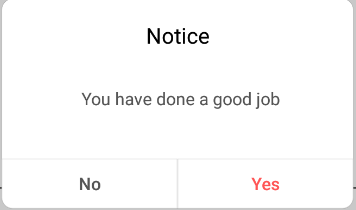
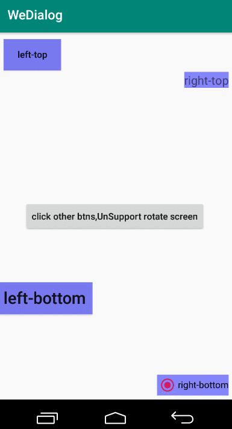

## WeDialog

#### 基于DialogFragment实现的一个对话框封装库，可以使得普通对话框以及自定义View的对话框的展示更加自由，简单。

### 目前该库有以下特性：

- 使用简洁；

- 可以给对话框设置锚点View

- 大量的定制属性

- 全局配置部分属性

- 屏幕旋转时保持数据和点击事件；


**e.g:**

可以简单的调用以下代码来展示图中的对话框


```
WeDialog.normal(this)
        .setTitle(getString(R.string.str_notice))
        .setMsg(getString(R.string.str_good_job))
        .show{
			//对话框 点击确定按钮回调
		 }
```



或者可以简单的这样调用，就能展现一个自定义界面的对话框，且对话框可以有锚点view


```
WeDialog.custom(this)
         .layout(R.layout.dialog_custom0)
         .setCancelableOutSide(true)
         .anchor(vTvLeftTop)
         .show { _,_,_ ->
          //当自定义view加载成功回调
		 }
```




### 如何引入


首先记得添加jcenter:

```
repositories {
     jcenter()
}
```


如果使用了Androidx:

```
implementation 'com.cysion:WeDialog:1.0.3.x'
```
否则：

```
implementation 'com.cysion:WeDialog:1.0.3'
```


### 使用

本库中有三种形式的对话框，使用分别如下:

- **LoadingDialog**

show loading:

```
WeDialog.loading(this)
```

dismiss loading:

```
WeDialog.dismiss()
```

**如果想要展示不同的加载框，则可以在上层module里创建+重写*we_dialog_loading.xml布局文件，需要指出的是，布局文件名字，一定是we_dialog_loading**


----------


- **NormalDialog**

最常见的对话框，标题，内容，确定，取消：

```
WeDialog.normal(this)
     .setTitle(getString(R.string.str_notice))
     .setMsg(getString(R.string.str_goog_job))
      .clickCancel {//可选项
          //点击取消键时回调 
       }
       .show {//必须调用，用来展示dialog
          //当点击确定按钮时回调 
       }
```

高级用法:

Method  | Description  
---|---
setTitle() | 设置标题，不设置则不展示
setTitleColor() | 设置标题颜色
setMsg() | 设置对话框内容文本
setMsgSize() | 设置内容文本字体大小
setYesText() | 设置确定按钮文本
setYesColor() | 设置确定按钮文本颜色
setNoText() | 设置取消按钮文本
showOneBtn() | true,仅展示确定按钮
clickCancel() | 设置取消按钮点击事件
setAnim() | 给对话框添加动画,@StyleRes
setWidthRatio() | 设置对话框宽度，相对屏幕宽度的比例，0-1f
setCancelable() | 设置对话框是否可以取消

**如果想要展示一个不同样式的对话框，可以在上层module中 新建-重写we_dialog_normal.xml布局文件，注意，布局名称和view的id都要与该布局相同。**


----------


- **CustomDialog**

自定义view的提示框

```
WeDialog.custom(this)
         .layout(R.layout.dialog_custom0)
         .show { _,_,_ ->
          //当自定义view加载完成时回调
		 }
```

高级用法:

Method  | Description  
---|---
layout() | 设置自定义布局的id, @LayoutRes
setGravity() | 设置对话框的gravity
params() | 为对话框提供额外数据
setDim() | 设置阴影值
setXOffset() | 设置X向偏移量,px
setYOffset | 设置Y向偏移量,px
anchor() | 给对话框设置锚点
setAnim() | 给对话框设置动画,@StyleRes
setWidthRatio() | 设置对话框宽度，相对屏幕宽度的比例，0-1f
setCancelable() | 设置对话框是否可以取消


**一些全局配置：WeDialog.initOnce(config: Config) **


### License


Copyright 2019 CysionLiu

Licensed under the Apache License, Version 2.0 (the "License");
you may not use this file except in compliance with the License.
You may obtain a copy of the License at

   http://www.apache.org/licenses/LICENSE-2.0

Unless required by applicable law or agreed to in writing, software
distributed under the License is distributed on an "AS IS" BASIS,
WITHOUT WARRANTIES OR CONDITIONS OF ANY KIND, either express or implied.
See the License for the specific language governing permissions and
limitations under the License.
```


